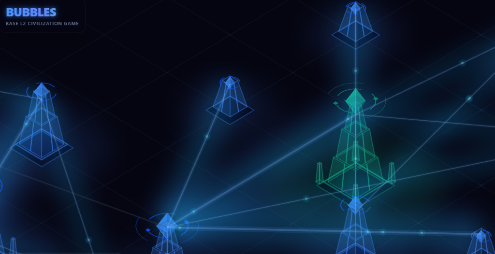
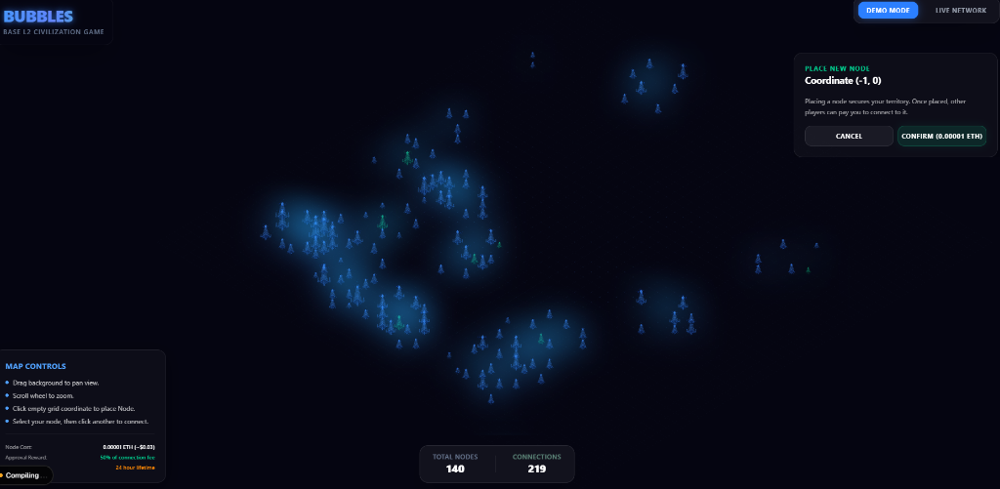
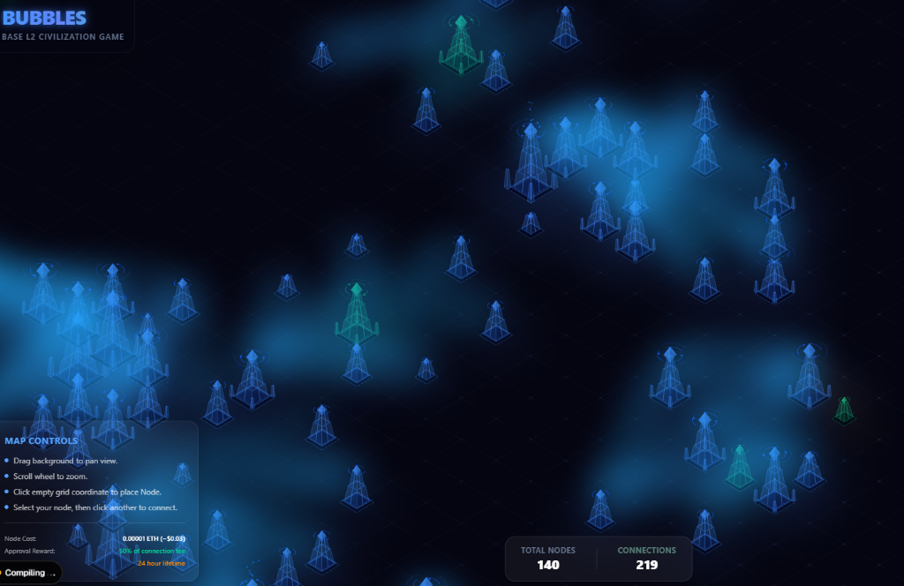
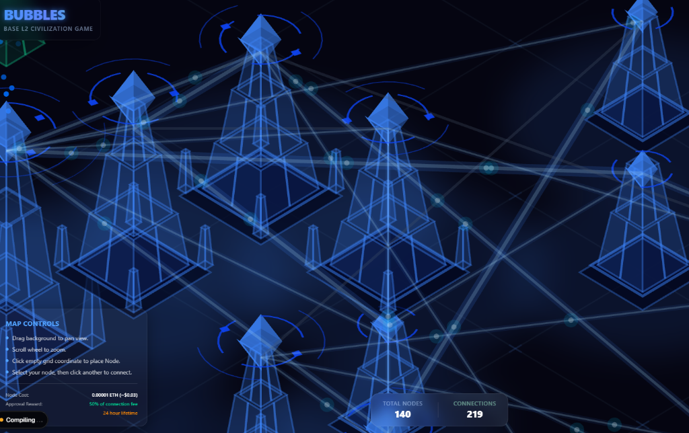

# BubbleBase (Base L2 Civilization Game)



BubbleBase is an isometric, decentralized civilization game built directly on the **Base L2 Ethereum network**. In this dystopian, cyberpunk world, raw coordinate grid space is real estate, and survival depends on data bandwidth and network connectivity.

* **Live dApp**: [bubblebase.vercel.app](https://bubblebase.vercel.app)
* **Contract Address**: Deployed on Base L2 at `0x525eE261f2E22E14a10C699A9A11BB521Bd8a2C5` (Creator Address)

---

## 🎮 Gameplay & Interfaces

Here is the visual progression of the Grid, showcasing zoom levels, nodes, connections, and the isometric graphics engine:





### 👤 The Layman's Quickstart

Welcome to the Grid, Architect. BubbleBase is a game about building empires out of data pipelines.

1. **Claim Your Real Estate (Place Nodes)**: Click on any empty intersection on the grid to deploy a basic infrastructure **Node** (Pylon). This registers your node permanently on-chain.
2. **Expand Your Net worth (Forge Connections)**: Select your node, then click another player's node to request a connection. Bandwidth is strength—as your node accumulates links, it procedurally transforms from a humble **Pylon** into a towering **Citadel**.
3. **Earn Passive Yield (Collect Rewards)**: Every time another player connects nearby, nurtures a link, or boosts their network speed, they pay fees into a global reward pool. You can claim your accumulated ETH yield at any time directly through the dApp dashboard.
4. **Prevent Grid Decay (Nurture & Boost)**: Connections suffer from entropy and decay after 24 hours, turning into dead grey wires. Reset the timer by **Nurturing** the link, or **Boost** it to overclock your throughput and visual power streams.

---

## 🛠️ GameFi & Blockchain Expert Deep Dive

For Solidity developers and GameFi engineers, BubbleBase is a gas-efficient, undirected-graph civilization state engine with a DeFi-style staking-reward accumulator.

### 1. Smart Contract Architecture (`hardhat_project/contracts/Bubbles.sol`)

* **Bit-Packed Coordinate Real Estate**:
  Nodes are indexed by their coordinates using a custom 64-bit coordinate compression scheme mapping 32-bit signed integers `(int32 x, int32 y)` to a `uint64` hash:
  ```solidity
  function encodeCoordinate(int32 x, int32 y) public pure returns (uint64) {
      return (uint64(uint32(x)) << 32) | uint64(uint32(y));
  }
  ```
  This eliminates nested layout mappings (`mapping(int32 => mapping(int32 => address))`) and cuts gas usage significantly by maintaining a flat `mapping(uint64 => address) public nodes`.

* **Undirected Connection Representation**:
  Since connections are undirected, lookup keys are generated deterministically by sorting node coordinate keys before computing a `keccak256` hash:
  ```solidity
  function getConnKey(uint64 a, uint64 b) public pure returns (bytes32) {
      return a < b ? keccak256(abi.encodePacked(a, b)) : keccak256(abi.encodePacked(b, a));
  }
  ```

---

### 2. Parametric Fee Formulas & Game Economics

BubbleBase features automated, on-chain congestion and distance pricing:

#### A. Placement Fee
A flat rate paid in native ETH to spawn a new Node:
$$\text{Placement Fee} = ACTION\_FEE = 0.00001\text{ ETH}$$

#### B. Dynamic Connection Fee
Connecting to highly popular nodes or across long distances demands premium bandwidth fees:
$$\text{Connection Fee} = ACTION\_FEE + \text{ConnectionPremium} + \text{DistancePremium}$$
$$\text{ConnectionPremium} = \max(0, \text{toNodeConnections} - \text{fromNodeConnections}) \times 0.000005\text{ ETH}$$
$$\text{DistancePremium} = \text{ManhattanDistance} \times 0.000001\text{ ETH}$$
$$\text{ManhattanDistance} = |x_2 - x_1| + |y_2 - y_1|$$
*This discourages spam and penalizes extreme spatial separation, encouraging localized organic node clusters.*

#### C. Nurture Fee
Paid to reset the 24-hour decay timer of a connection:
$$\text{Nurture Fee} = 0.000002\text{ ETH} + (\text{ManhattanDistance} \times 0.0000002\text{ ETH})$$

#### D. Boost Fee
Paid to increment the connection yield multiplier (overclocking):
$$\text{Boost Fee} = 0.000005\text{ ETH} + (\text{ManhattanDistance} \times 0.0000005\text{ ETH})$$

---

### 3. DeFi Staking-Reward Accumulator Pool

Rather than running gas-expensive, recursive payout loops that iterate over nodes, the contract implements an **$O(1)$ reward accumulator** (similar to the Synthetix staking reward algorithm).

#### Fee Distribution Splits
* **Creator Cut**: A flat **5%** creator fee is deducted and routed instantly to the developer treasury (`0x525eE261f2E22E14a10C699A9A11BB521Bd8a2C5`) on every state-mutating action.
* **Staking Pool Contribution**:
  * **50%** of Connection fees go to the global reward pool.
  * **95%** of Nurture and Boost fees go to the global reward pool.
  * The remainder acts as a contract balance reserve.

#### Mathematical Payout Mechanics
The global variable `rewardPerConnection` tracks cumulative distributed ETH per unit connection weight, scaled by $10^{18}$:
$$\Delta \text{rewardPerConnection} = \frac{\text{FeeContribution} \times 10^{18}}{\text{totalConnections}}$$

When a node's reward state is updated (`_updateNodeRewards`), its pending rewards are calculated lazily, and its `nodeRewardDebt` is updated:
$$\text{PendingReward}(node) += \frac{\text{connectionCounts}[node] \times \text{rewardPerConnection}}{10^{18}} - \text{nodeRewardDebt}[node]$$
$$\text{nodeRewardDebt}[node] = \frac{\text{connectionCounts}[node] \times \text{rewardPerConnection}}{10^{18}}$$

This guarantees that active, highly connected nodes receive a mathematically proportional share of *all* network activity fees globally. Staking claims can be made in batches via `claimRewards(uint64[] nodeKeys)`.

---

## 🖥️ 2.5D Graphics Engine & Renderer (`src/components/GameMap.tsx`)

The client interface is driven by a highly optimized **PixiJS (v8)** rendering loop projecting grid positions into isometric perspective.

### 📐 Isometric Projection Matrix
The renderer maps 3D world coordinates $(x_{world}, y_{world}, z_{world})$ into 2D screenspace $(x_{screen}, y_{screen})$:
$$x_{screen} = \frac{x_{world} - y_{world}}{\sqrt{2}}$$
$$y_{screen} = \frac{x_{world} + y_{world}}{\sqrt{2}} \times \text{ISO\_PITCH} - z_{world}$$
* **`ISO_PITCH = 0.6`** defines the tilt of the grid.
* The $z_{world}$ variable represents building height. Drawing structures along the negative vertical offset ensures towers rise vertically parallel to the screen edges, maintaining spatial alignment.

### 🏢 Procedural Node Progression
Towers dynamically scale their structural density, components, and animations based on their on-chain connection count:
* **Tier 0 (Pylon | 0-1 connection)**: A basic concrete slab foundation supporting a single floating crystal core.
* **Tier 1 (Spire | 2-3 connections)**: A double-segment stepped obelisk featuring basic gyroscopic orbit rings.
* **Tier 2 (Bastion | 4-5 connections)**: A triple-prism tower with 4 outlying stabilizer pylons and 2 independent orbiting satellites.
* **Tier 3 (Citadel | 6+ connections)**: An architectural monolith, 4 giant corner structures, 3 counter-rotating gyroscopic rings, 4 orbital satellites, and a custom particle emitter venting glowing sparks from the core.

### ⚡ Level of Detail (LOD) Heatmap Optimizations
To preserve high rendering performance (60 FPS) when displaying hundreds of nodes:
* The engine uses a dynamic `PIXI.BlurFilter` layered on a secondary viewport.
* As you zoom out, the sharp, vector-drawn connection lines fade away and blend into a glowing, color-coded "congestion heatmap" showing network density.
* Explicit connection wires and fine geometric details only fade back into focus when zooming in on a specific cluster, avoiding GPU rendering bottlenecks.

---

## 🤖 AI Agent Autonomy Dashboard

BubbleBase bridges Web3 and autonomous agent loops. Players can delegate grid operations to **AI Agents** by configuring strategy parameters.

* **Autonomous Loops**: Features a local heuristic mode (Demo mode) and a serverless proxy loop `src/app/api/agent/route.ts` which forwards game metadata to LLM APIs.
* **AI Provider Integrations**: Native support for **OpenAI** (utilizing structured JSON formats), **Anthropic**, **Gemini**, and local **Ollama** instances.
* **Flexible Strategy Archetypes**:
  * **Expansionist/Aggressive**: Maximizes network size by strategically placing new nodes near active clusters.
  * **Maintainer/Defensive**: Minimizes decay risks by prioritizing nurturing and boosting connection timers.
* **Safety Soft Budgeting**: Enables client-side soft budget caps (in ETH) to control agent spend.
* **Visual UI Indicators**: Nodes controlled by active AI agents are highlighted in violet (`0x8b5cf6`) and rotate their gyroscopic rings 2.5x faster than standard player nodes.

---

## ⚡ Technical Optimizations

### 🪙 Gas Optimization
The `Connection` struct is packed into a single 32-byte storage slot to compress storage overhead:
```solidity
struct Connection {
    uint64 lastNurturedAt;
    uint16 boostMultiplier; // 100 = 1.0x, 200 = 2.0x, max 300 = 3.0x
    bool active;
}
```
* **Impact**: Saves ~40,000 gas on initial connection approval and ~20,000 gas on every subsequent nurture/boost call, keeping transaction fees extremely low (~3 cents on Base L2).

### 🖥️ Memory Garbage Collection
* **WebGL Context Destructors**: Prevented GPU memory leaks on map rebuilds by explicitly iterating over the `nodeContainersMap` and calling `.destroy({ children: true })` on each node's container tree before clearing references.
* **Handler Cleanup**: Named scroll/pan handlers are cleanly unregistered (`removeEventListener('wheel', ...)`) upon component unmounting.

---

## 🛠️ Project Development Setup

### Installation
Clone the repository and install dependencies:
```bash
npm install
```

### Run Local Node & Contracts
1. Compile and test contracts:
   ```bash
   cd hardhat_project
   npx hardhat test
   ```
2. Start local Hardhat network:
   ```bash
   npx hardhat node
   ```
3. Deploy contracts to local network:
   ```bash
   npx hardhat run scripts/deploy.js --network localhost
   ```

### Run Next.js Web App
Start the Next.js development server:
```bash
npm run dev
```
